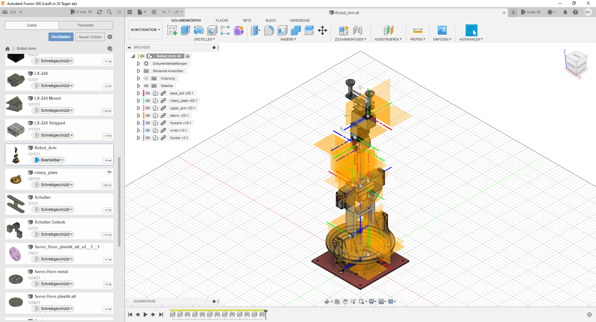
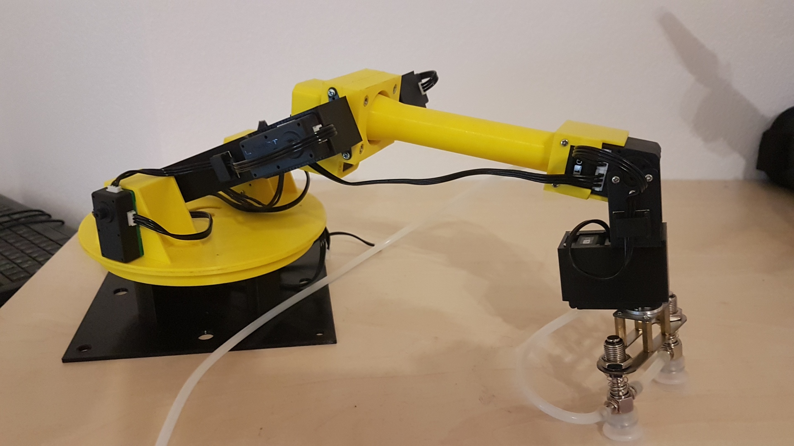
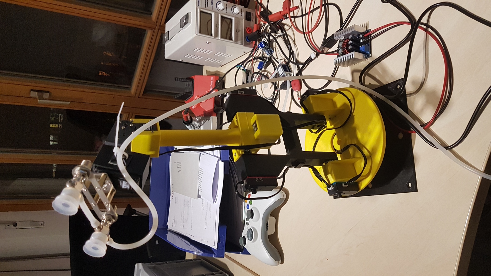
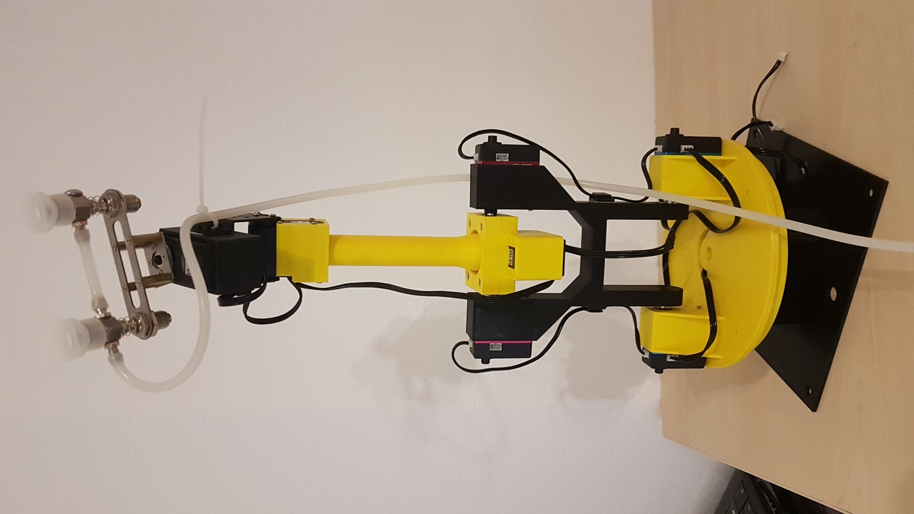

# RobotArm_6DOF
3d printable Robot Arm with position feedback. ROS and MoveIt integration available

## Robot Arm Model

This robot arm was designed with Fusion 360.
Corresponding files can be found in the Fusion 360 directory or under the follwwing Fusion 360 cloud link
https://a360.co/3DrlJYs

 

## Prerequities

To use this package you need to instal

- ROS
- MoveIt! 
- Python3

## BOM
- 2x Lewansoul LX-224
- 2x Lewansoul LX-225
- 4x Lewansoul LX 16a
- 1x Lewansoul BusLinker TTL/USB
- 1x Bearing, 6805-2RS

